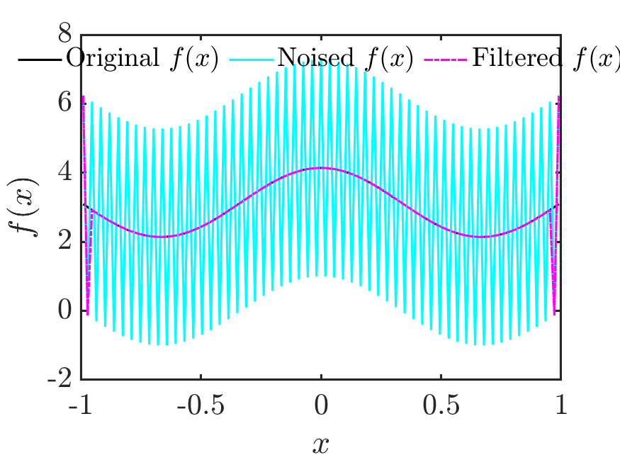
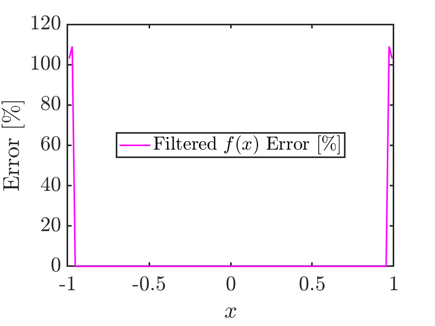
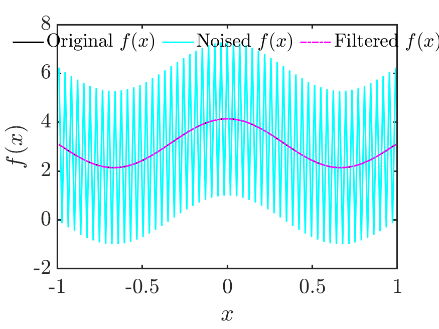
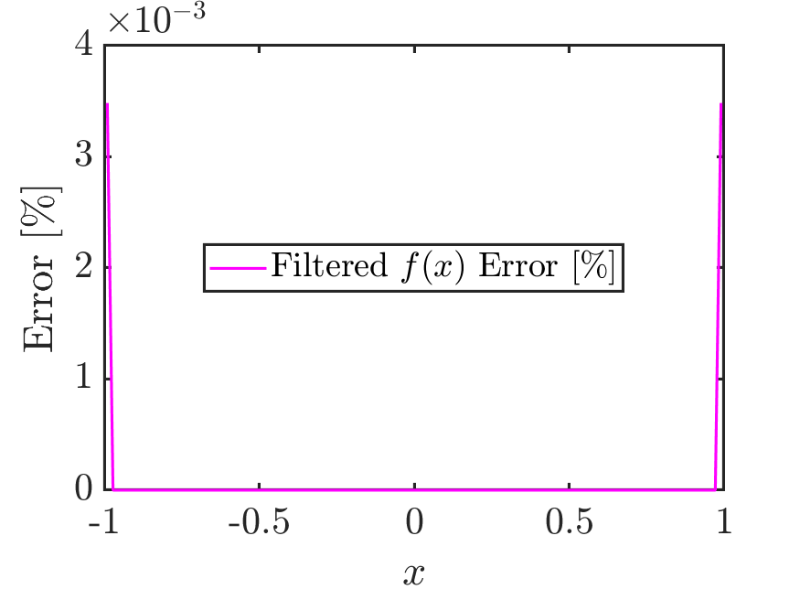
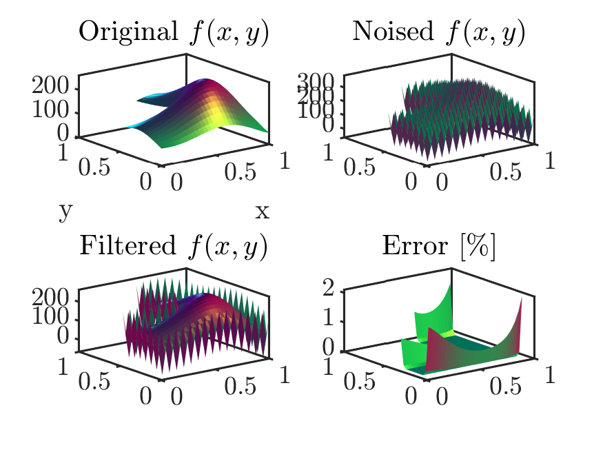
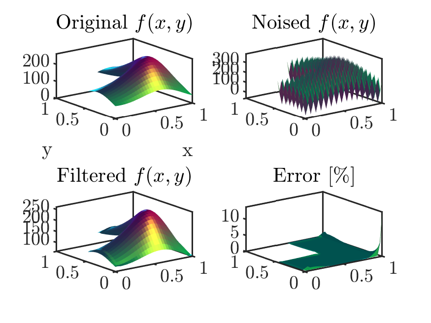

# Explicit Selective Filters
An implementation of the explicit Taylor-based filters presented by Bogey and Bailly (2004).
Using Matlab, these filters are here implemented as matrix operators suitable for using along with explicit/compact finite-difference schemes. 

|  Test  | True / Noised / Filtered f(x) | Error w.r.t. True f(x) |
|:------:|:-------------------------------:|:---------------------------:|
|   1D   |  |  |
|  1D+BC |  |  |

|  Test  |  Direct Explicit Filter |  Explicit Filter Operator |
|:------:|:-----------------------:|:-------------------------:|
|   2D   |  |  |
|  2D+BC |   |  |

## References
- Bogey, C., & Bailly, C. (2004). A family of low dispersive and low dissipative explicit schemes for flow and noise computations. Journal of Computational physics, 194(1), 194-214.
- Berland, J., Lafon, P., Daude, F., Crouzet, F., Bogey, C., & Bailly, C. (2011). Filter shape dependence and effective scale separation in large-eddy simulations based on relaxation filtering. Computers & Fluids, 47(1), 65-74.
